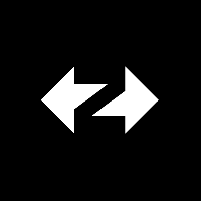
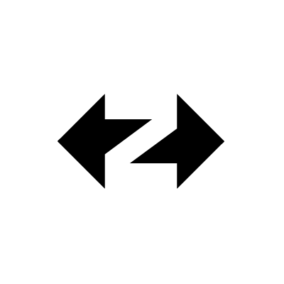
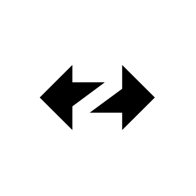

# Icons

<figure><figcaption>
ZKsync.png
</figcaption></figure>

<figure><figcaption>
ZKsync Era black.png
</figcaption></figure>

 

<figure><figcaption>
ZKsync Era black.svg
</figcaption></figure>

<figure><figcaption>
ZKsync Era.png
</figcaption></figure>

 

<figure><figcaption>
ZKsync Era.svg
</figcaption></figure>

