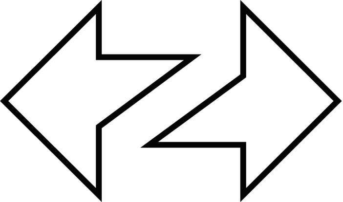
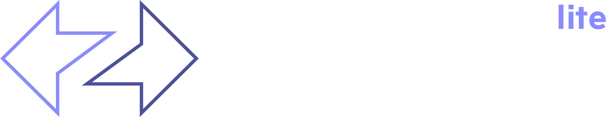
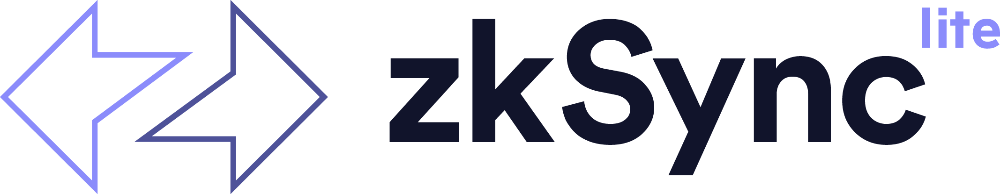

# ZKsync Lite

<figure><figcaption>ZKsync Lite Dark.png</figcaption></figure>

<figure><figcaption>ZKsync Lite white.png</figcaption></figure>

<figure><figcaption>ZKsync Lite white.svg</figcaption></figure>

<figure><figcaption>ZKsync Lite.png</figcaption></figure>

<figure><figcaption>ZKsync Lite.svg</figcaption></figure>

