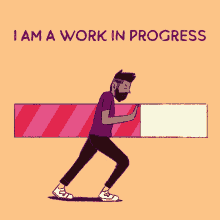

# 🦄 zkSuccess

## Meet zkSuccess

zkSuccess is a diverse group that embodies the qualities of being helpful, motivated, and inclusive. As the first line of support, zkSuccess plays a vital role in onboarding new zkSync community members. They are actively involved in the Discord server, providing assistance and guidance to both new and existing community members. By fostering a welcoming and supportive environment, they help to strengthen and grow the zkSync community.


✋ **Before you dive in, let's ensure you're joining the program with the right mindset and motivations.**


🧠 **Understanding the real purpose:** Being part of zkSuccess is about more than just personal gain—it's about contributing to the growth and development of the zkSync Ecosystem while having fun doing so!

🤝 **Community Connection:** As a member of zkSuccess, you'll have the chance to connect with new people, make new friends, and work together to achieve common goals.

🌱 **Educational Growth:** zkSuccess will play a key role in introducing zkSync and the ZK Stack to millions of users worldwide and accelerating the mass adoption of crypto to enhance personal freedom.

🙂 **Embracing the mission with a smile:** You’ll promote a supportive environment filled with enthusiasm and guidance for all members of the zkSync community, and of course, create memes!

### Expectation Check:

🚫 **Not** **Just a Title**: It’s about active engagement, not just holding a prestigious label.

🚫 **Not** **a Solo Journey**: It’s about being part of a team where every action contributes to our shared success.

🚫 **Not About Stardom:** It’s not a shortcut to the limelight or a golden ticket to Willy Wonka! Think of it more like joining a passionate community with a common goal.

### **Benefits of Joining** zkSuccess:

👤 **Personal Development**: Enhance your understanding of blockchain technology and zero-knowledge proofs.

🤗 **Recognition**: Get acknowledged for your efforts in a leading-edge tech community.

🔗 **Networking**: Connect with industry experts, enthusiasts, and professionals in the blockchain space.

🎉 **Events**: Participate in community gatherings, AMAs, and other special events.

***

## The Road to zkSuccess


zkSuccess <mark style="color:purple;">**Rookie**</mark>** →** zkSuccess <mark style="color:purple;">**Intern**</mark>** →** zkSuccess <mark style="color:purple;">**Pro**</mark>


***


Check back later for more details 😎


<figure><figcaption></figcaption></figure>
